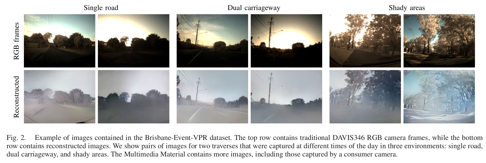

# Event-Based Visual Place Recognition With Ensembles of Temporal Windows

[](https://creativecommons.org/licenses/by-nc-sa/4.0/)
[](https://github.com/Tobias-Fischer/ensemble-event-vpr/stargazers)
[](https://github.com/Tobias-Fischer/ensemble-event-vpr/issues)
[](./README.md)
<a href="https://qcr.github.io" alt="QUT Centre for Robotics Open Source"></a>

### License + Attribution
This code is licensed under [CC BY-NC-SA 4.0](https://creativecommons.org/licenses/by-nc-sa/4.0/). Commercial usage is not permitted. If you use this dataset or the code in a scientific publication, please cite the following [paper](http://doi.org/10.1109/LRA.2020.3025505) ([preprint and additional material](https://arxiv.org/abs/2006.02826)):

```
@article{fischer2020event,
  title={Event-Based Visual Place Recognition With Ensembles of Temporal Windows},
  author={Fischer, Tobias and Milford, Michael},
  journal={IEEE Robotics and Automation Letters},
  volume={5},
  number={4},
  pages={6924--6931},
  year={2020}
}
```

The [Brisbane-Event-VPR dataset](https://zenodo.org/record/4302805) accompanies this code repository: https://zenodo.org/record/4302805




## Code overview
The following code is available:
- The [correspondence_event_camera_frame_camera.py](./correspondence_event_camera_frame_camera.py) file contains the mapping between the rosbag names and the consumer camera video names. The variable `video_beginning` indicates the ROS timestamp within the bag file that corresponds to the first frame of the consumer camera video file.
- The [read_gps.py](./read_gps.py) file contains some helper functions to read in GPS data from the provided nmea files, and find matches between two traverses.
- The [code_helpers_public.py](./code_helpers_public.py) file contains some helper codes.
- The [code_helpers_public_pr_curve.py](./code_helpers_public_pr_curve.py) file contains some helper codes to get precision, recall and precision-recall curves given a distance matrix.
- The main code is contained in the [Brisbane Event VPR.ipynb](./Brisbane%20Event%20VPR.ipynb) notebook.

Please note that in our paper we used manually annotated and then interpolated correspondences; instead here we provide matches based on the GPS data. Therefore, the results between what is reported in the paper and what is obtained using the methods here will be slightly different.

## Reconstruct videos from events
1. Clone this repository: `git clone https://github.com/Tobias-Fischer/ensemble-event-vpr.git`

1. Clone https://github.com/cedric-scheerlinck/rpg_e2vid and follow the instructions to create a conda environment and download the pretrained models.

1. Download the [Brisbane-Event-VPR dataset](https://zenodo.org/record/4302805).

1. Now convert the bag files to txt/zip files that can be used by the event2video code: `python convert_rosbags.py`. Make sure to adjust the path to the `extract_events_from_rosbag.py` file from the rpg_e2vid repository.

1. Now do the event to video conversion: `python reconstruct_videos.py`. Make sure to adjust the path to the `run_reconstruction.py` file from the rpg_e2vid repository.

## Create suitable conda environment
1. Create a new conda environment with the dependencies: `conda create --name brisbaneeventvpr tensorflow-gpu pynmea2 scipy matplotlib numpy tqdm jupyterlab opencv pip ros-noetic-rosbag ros-noetic-cv-bridge python=3.8 -c conda-forge -c robostack`

## Export RGB frames from rosbags
1. `conda activate brisbaneeventvpr`

1. `python export_frames_from_rosbag.py`

## Event-based VPR with ensembles
1. Create a new conda environment with the dependencies: `conda create --name brisbaneeventvpr tensorflow-gpu pynmea2 scipy matplotlib numpy tqdm jupyterlab opencv pip`

1. `conda activate brisbaneeventvpr`

1. `git clone https://github.com/QVPR/netvlad_tf_open.git`

1. `cd netvlad_tf_open && pip install -e .`

1. Download the NetVLAD checkpoint [here](http://rpg.ifi.uzh.ch/datasets/netvlad/vd16_pitts30k_conv5_3_vlad_preL2_intra_white.zip) (1.1 GB). Extract the zip and move its contents to the checkpoints folder of the `netvlad_tf_open` repository.

1. Open the [Brisbane Event VPR.ipynb](./Brisbane%20Event%20VPR.ipynb) and adjust the path to the `dataset_folder`.

1. You can now run the code in [Brisbane Event VPR.ipynb](./Brisbane%20Event%20VPR.ipynb).

# Related works
Please check out [this collection](https://qcr.github.io/collection/vpr_overview/) of related works on place recognition.
